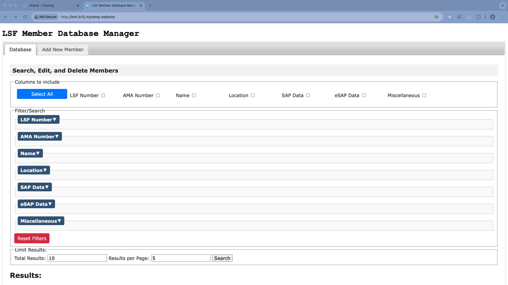
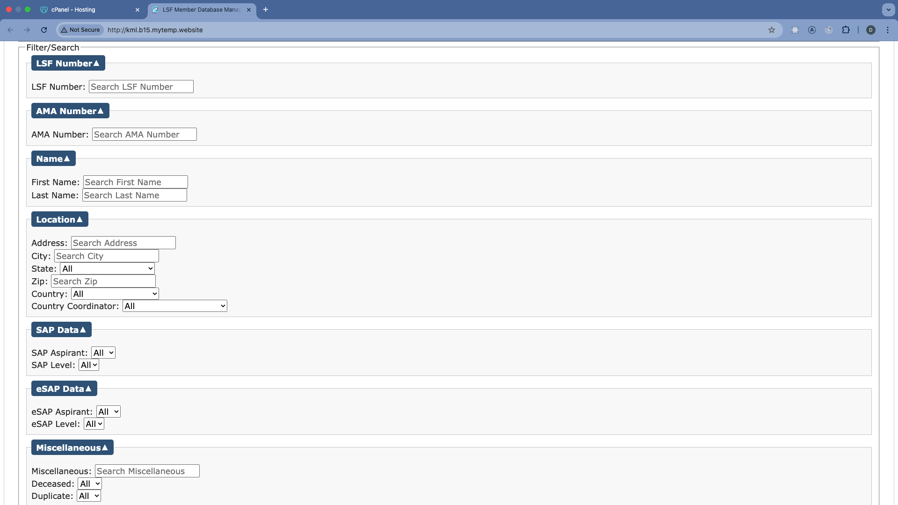
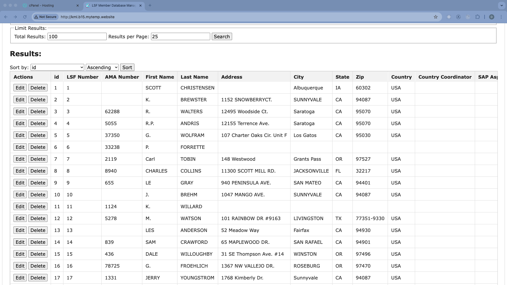
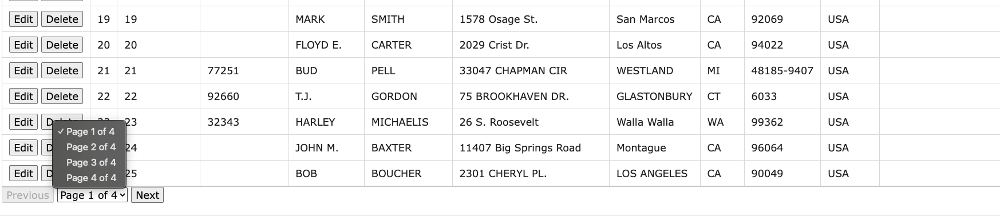
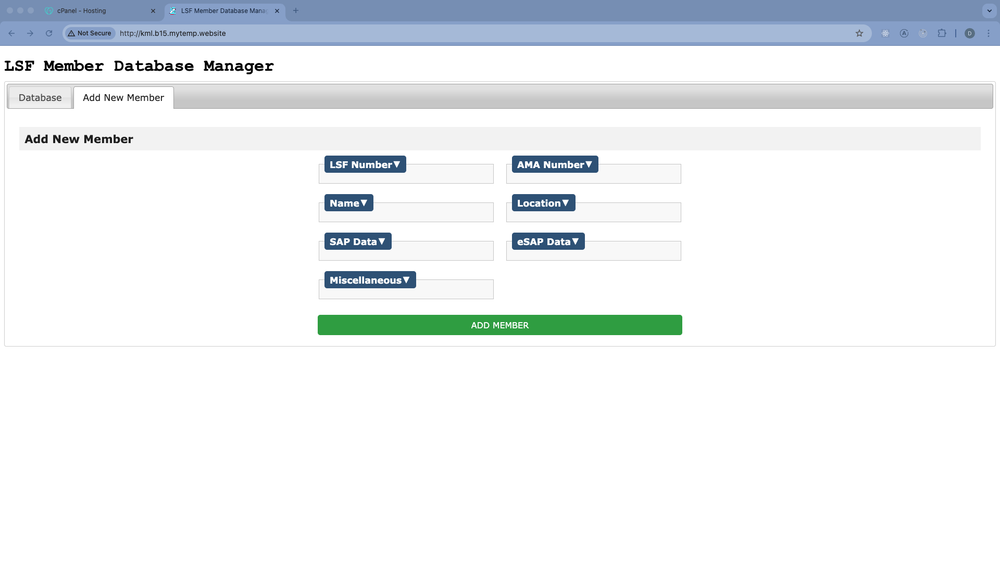
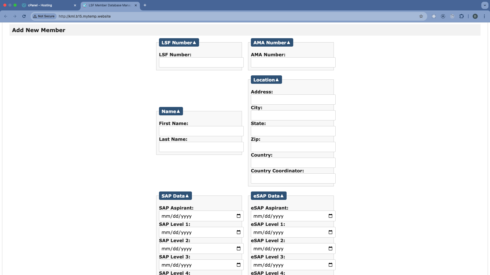
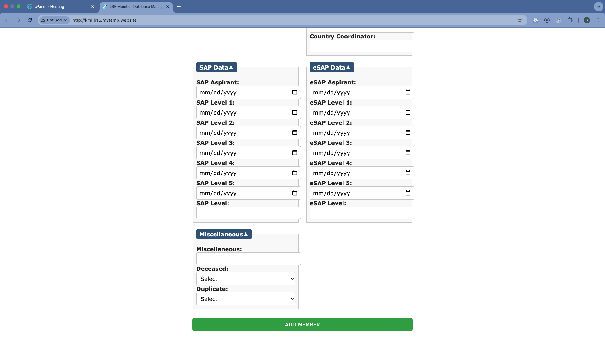

# LSF Database Manager

## 

## Summary

This LSF Database Manager application is designed for administrative members of the League of Silent Flight (LSF).

This application presents an intuitive user-interface which will simplify access and operations on the LSF's member database.

Admins can use this to create, read, update, and delete members from the database.

Search tool allows for column selection (i.e. Name, Location, etc.), advanced filtering (by specific name, zip code, etc.), and sorting (ascending/descending) by column.

Displayed results (member entries) are both easily editable and deletable.

The "Add New Member" tab allows for the creation of a new member entry.

## Table of Contents

- [Installation](#installation)
- [Usage](#usage)
- [Contributions](#contributions)
- [License](#license)

## Installation

Navigate to [current GoDaddy hosting domain](http://kml.b15.mytemp.website/)

An error may be encountered, as a result (I think) of the current SSL certificate being "self-signed". This is an issue that will be worked out soon.

Here is the temporary solution:

On Google Chrome: If site displays "Your connection is not private," click the "Advanced" button at the bottom of the page, scroll down, and click "Proceed... (unsafe)".

The site should be accessible thereafter.

## Usage

Below, I give a text/image-based overview of the web application.

For a more detailed tutorial of usage of the application, [click this link to the video tutorial.](https://drive.google.com/file/d/1aRPZ4tEvGw10G-RteV6DArJxlBTrTnCL/view?usp=sharing)

---

Here is the landing page for [http://kml.b15.mytemp.website/](http://kml.b15.mytemp.website/)

User may select columns to include, search specific strings (i.e. for first name "Peter"), and limit the # of total results as well as # of items per page.

The "Select All" button for the "Columns to include" section can be clicked to select/deselect all columns to return in your search.

The "Filter/Search" section can be expanded like so:

At the bottom of this section is a red "Reset Filters" button, which clears all of the search fields and returns the dropdowns to the default "All".

A simple search, all columns and no filters, with 100 total results and 25 results per page, will yield the following display:

As you can see, at the top of the results is a sorting control. You may select which column to sort by, and whether to sort by ascending or descending order. Edit and delete buttons appear to the left of each entry.

If you scroll down, there are pagination controls: previous, next, and a page-selector dropdown menu.

If you click on the "Add New Member" tab at the top of the page, we are taken here:

Each section can be expanded, exposing all relevant fields for a new member:

The small calendar icons next to some of these fields, when clicked, will pop up a "datepicker" widget (a calendar) from which the correct date may be selected.
The "Add Member" button will, of course, add the new member to the database.

## License

This application is covered under the [MIT](https://opensource.org/licenses/MIT) license.

## Contributions

Thank you to Ed Dumas for getting me oriented with this web development framework-- with cPanel, phpMyAdmin, and setting up a basic php/html site.

## Questions

Please send me an email or text (your preference) if you have any questions.

[Email](mailto:danrcross@gmail.com)
Cell: 865-924-9851
