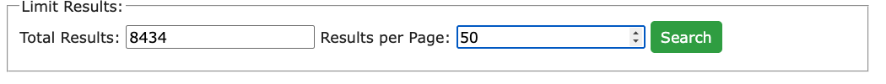

# LSF Database Manager

## 

## Summary

This LSF Database Manager application is designed for administrative members of the League of Silent Flight (LSF).

This application presents an intuitive user-interface which will simplify access and operations on the LSF's member database.

Admins can use this to create, read, update, and delete members from the database.

Search tool allows for column selection (i.e. Name, Location, etc.), advanced filtering (by specific name, zip code, etc.), and sorting (ascending/descending) by column.

Displayed results (member entries) are both easily editable and deletable.

The "Add New Member" tab allows for the creation of a new member entry.

## Table of Contents

- [Installation](#installation)
- [Usage](#usage)
- [Contributions](#contributions)
- [License](#license)

## Installation

Navigate to [current GoDaddy hosting domain](http://kml.b15.mytemp.website/)

Select the "Member Database Manager" tab on the navigation bar at the top of the page.

## Usage

Below, I give a text/image-based overview of the web application.

For a quicker overview of the application, [click this link to the video tutorial.](https://drive.google.com/file/d/1EVbvhd5h-W7AWF_we69wSMBcp1R_9raa/view?usp=drive_link)

---

Here is the landing page for [http://kml.b15.mytemp.website/](http://kml.b15.mytemp.website/)

The first thing we can see is the column selection tool. I might choose to limit which columns I want displayed in my results:

Below this section are the filter/search options. By clicking on the "LSF Number [Down Arrow]" tab, we can expand this section. The left slider selects the lower limit, and the right the upper limit. Here we are searching for members from LSF # 1248 to LSF # 4439.

The checkbox must be selected in order to apply the range filter, like so.

These sections are pretty straightforward-- you may simply type the text you are filtering for in each section.

Some dropdown menus retrieve their options from the database, such as the dropdown menu for "Country Coordinator":

The remaining dropdown menus are also straightforward:

We can search for living members by selecting "False" for "Deceased".

Also, note the "Reset Filters" button. This simply removes any text, dropdown selection, etc. It is a fresh start for the Filter/Search section.

The "limit results" section allows you to limit the total # of results, as well as the # of results per page. By default, the "total results" is set to the current total number of members in the database.

In this example, I will leave the "total results" as the default, and set the "results per page" to "50".

After pressing the green "search" button, the page returns my results. My search-- filtering by the selected LSF # range as well as including only living members-- returned 3192 results, as we can see directly below "Results:".

In this image, we can also see:

- the "Download CSV" and "Download PDF" buttons, to the right,
- below the # results returned, a "sort by" feature,
- below the "sort by" feature, a bulk edit/delete tool,
- at the leftmost header of the table, a "select all" checkbox,
- in the leftmost column of each member entry, a "select" checkbox,
- in the column to the right of the checkbox, 3 buttons: "edit", "delete", and "verify address",
- and, of course, the results (members)

I will explain these features in detail below

Pressing the "Download CSV" button will trigger a download of a CSV (spreadsheet) file containing the data produced by my search results. It can be found here, at the downloads button on my toolbar (Google Chrome)

Opening the file should show a spreadsheet (in your default .csv application) that looks like this:

The "Download PDF" button works similarly, but should result in a PDF file that looks like the image below. (Note that only the columns which I initially selected for my search are included in the CSV and PDF.)

## License

This application is covered under the [MIT](https://opensource.org/licenses/MIT) license.

## Contributions

Thank you to Ed Dumas for getting me oriented with this web development framework-- with cPanel, phpMyAdmin, and setting up a basic php/html site.

## Questions

Please send me an email or text (your preference) if you have any questions.

[Email](mailto:danrcross@gmail.com)
Cell: 865-924-9851
